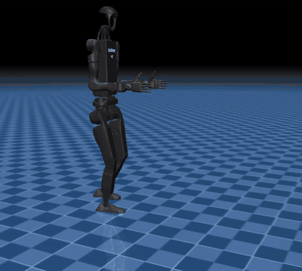
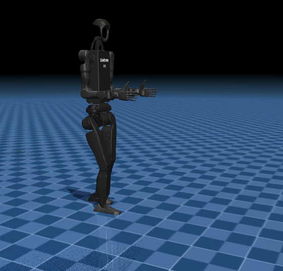

# Humanoid Balance and Locomotion — Unitree H1-2 in MuJoCo

A full balance and walking control stack for a **67 kg, 51-DOF Unitree H1-2
humanoid**, built from torque control upward in **MuJoCo**, then compared against
a learned RL policy and ported to ROS 2 / Gazebo.

90 Python modules, every constant measured rather than assumed.

<p align="center">
  
</p>
<p align="center"><em>H1-2 walking under the controller in this repository &mdash; MuJoCo, 51 actuated joints.</em></p>

## Goal

A humanoid standing still is running a controller. If that controller stops, it
falls. This project builds that controller from first principles and measures
what each layer buys:

**torque control → centre-of-mass and centre-of-pressure estimation → ankle
strategy → upper-body momentum → stepping → walking → learned policy → terrain →
ROS 2**

Each stage is measured against the one before it, and the results decide what
gets built next.

## The measurement that starts everything

Hold every joint at its exact commanded angle, let go, and the robot collapses:

```
pelvis height   1.030 m  →  0.415 m     in 6 seconds
```

Position control cannot balance, because **angles are not momentum**. That single
number motivates the entire torque-control stack that follows.

## Results

### Balance: what each strategy is worth

| controller | survives a push of | notes |
|---|---|---|
| position hold | — | collapses under its own weight in 6 s |
| ankle strategy | small disturbances | support polygon is **0.0264 m²** — a shoe |
| + upper-body momentum | larger | H1-2 has **no waist pitch**, so the textbook hip strategy is unavailable |
| + stepping | largest | past a threshold it *must* step or fall |

The reaction window from the linear inverted pendulum model is **0.308 s**.

**A textbook strategy this robot cannot run.** Nearly every humanoid balance
reference describes ankle → hip → stepping. H1-2's only waist joint is **yaw**,
so there is no hip-pitch strategy to run: all sagittal leverage is in the legs,
and the recoverable equivalent is an upper-body *momentum* strategy. Checking the
joint inventory against the literature changed the controller.

### Walking

Classical stack: lateral controller → LIPM centre-of-mass trajectory → foot
placement and swing trajectories → swing-leg inverse kinematics → whole-body QP →
joint torques.

**Crouch buys step length.** Step length is limited by a leg of fixed length, so
hip height trades directly against stride:

```
0.152 m  →  0.493 m step length     for 0.15 m of crouch
```

Which is why every walking humanoid you have seen walks with bent knees. A 2-link
model of the 3-segment leg gives `nan` — the geometry has to be right.

### Classical vs learned

The same robot, driven by a BSD-3 pre-trained RL policy (**47 observations → 12
actions**), walks **12.9 m in 30 s**. The comparison is run under identical push
disturbances, and the sections on what the policy *does not know* measure its
failure modes rather than asserting them.

### Sim-to-sim

The same controller runs in **MuJoCo** and in **Gazebo via ros2_control** at a
400 Hz effort-control loop. `ros2/gz_vs_mujoco.py` measures what transfers and
what does not.

## Repository layout

```
robot/          model, kinematics, dynamics — 51 actuated joints
                (12 legs + 14 arms + 24 fingers + 1 torso), CoM and contact
balance/        torque control, CoM/CoP estimation, ankle strategy,
                upper-body momentum, push tests, stepping
walking/        LIPM trajectories, foot placement, swing IK, whole-body QP,
                gait debugging traces
learned/        the RL policy: observation vector, deploy loop, failure modes,
                classical-vs-learned comparison
manipulation/   arm control while walking, 24-joint hand closure,
                carrying a load, task-priority control
terrain/        slopes, steps and gaps, stairs, disturbance rejection,
                the failure gallery
ros2/           Gazebo bringup, ros2_control at 400 Hz, state/command
                bridging, sim-to-sim comparison, capstone mission
data/           measured traces (JSON)
```

## Running it

```bash
pip install mujoco pinocchio numpy scipy
python balance/let_go.py            # the 1.030 -> 0.415 m collapse
python balance/ankle_control.py     # ankle strategy, and where it runs out
python walking/first_steps.py       # the classical walking stack
python learned/deploy_loop.py       # the RL policy, end to end
python terrain/failure_gallery.py   # every way it falls, and why
```

<p align="center">
  
</p>

**Robot:** Unitree H1-2, BSD-3-Clause, from `unitreerobotics/unitree_ros`.
67.37 kg, CoM 0.941 m in the spawn pose, **6 DOF per leg including ankle pitch
*and* roll** — ankle roll is the primary lateral balance actuator, so a balance
study cannot honestly skip it.

Two model scenes: `scene.xml` (12 DOF, legs only — what the walking policy was
trained against) and `scene_full.xml` (all 51 joints including hands).

## Method notes

- **Predictions are recorded and then killed.** Several claims written from the
  literature did not survive measurement — including the hip strategy above, and
  a gravity-compensation approach that made balance *worse* at both signs of the
  gain.
- **Stiffness is timing, not strength.** A 10x gain held the robot at 1.027 m
  asking 18 Nm, while a failing 3x gain asked 86.5 Nm.
- **`qpos` is not `7 + actuators`.** The H1-2 has `nu=51` but `nq=58`; nine frozen
  joints and fourteen fixed contacts are one array index apart. That bug produced
  plausible-looking wrong numbers for a full day.

## Licence

MIT — see [LICENSE](LICENSE).

The Unitree H1-2 model and the pre-trained locomotion policy are BSD-3-Clause
from Unitree Robotics and remain under their original licence.
